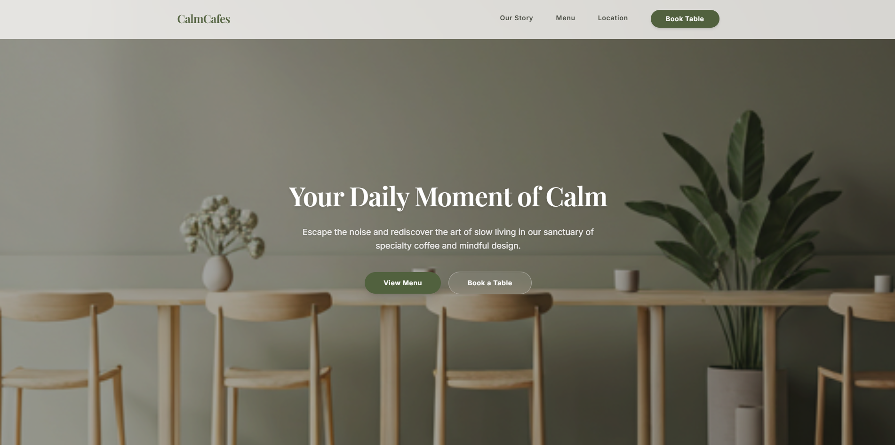

# CalmCafes — Your Daily Moment of Calm

A premium, modern web presence for CalmCafes, crafted for slow living, high-quality specialty coffee, and organic sourcing.

## Brand Philosophy
CalmCafes is anchored in **Sophisticated Serenity**. We target a discerning audience that values organic practices, slow living, and a quiet atmosphere. Generous whitespace frames high-quality lifestyle photography, creating an immediate sense of decompressing sanctuary.

## Features
- **Responsive Layout:** Editorial fluid columns optimized for both desktop grids and mobile viewpoints.
- **Interactive Booking:** An elegant pop-up modal for table reservations with stylized minimalistic forms.
- **Scroll Reveal Animations:** Micro-interactions that transition elements smoothly into view as you scroll.
- **Interactive Menu:** Quick-add toast notifications for ordering featured delights.

## Tech Stack
- **Framework:** Next.js 16 (App Router)
- **Language:** TypeScript
- **Styling:** Tailwind CSS v4
- **Fonts:** Playfair Display (Headings) & Inter (Body & UI)
- **Icons:** Google Material Symbols

## Live Demo
Experience the sanctuary of CalmCafes online at [calmcafes.vercel.app](https://calmcafes.vercel.app/).

---

# 🚀 Power of AI